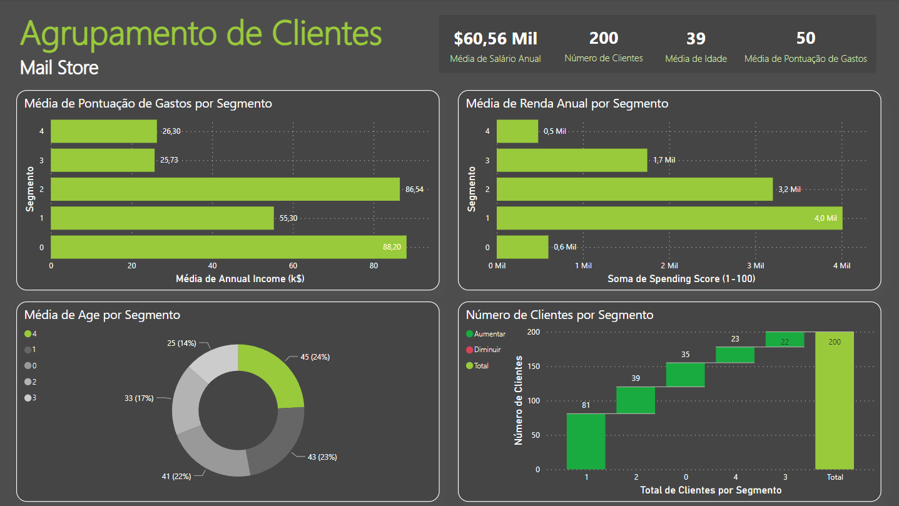

# Segmentação de Clientes

### Objetivo do Projeto
O principal objetivo deste projeto é utilizar técnicas de clusterização para segmentar os clientes de um shopping center. Ao aplicar métodos de clusterização, nossa intenção é aprofundar nossa compreensão sobre os perfis dos clientes e identificar aqueles mais propensos a realizar compras. Essa segmentação permitirá que a equipe de marketing seja munida com informações precisas sobre o público-alvo de cada segmento, possibilitando a criação de campanhas mais direcionadas e eficazes, e, consequentemente, aumentando o engajamento e as vendas.

### Fonte de Dados
- [Dataset Kaggle: Mall Customer Segmentation Data]([https://www.kaggle.com/datasets/vivek468/superstore-dataset-final](https://www.kaggle.com/datasets/vjchoudhary7/customer-segmentation-tutorial-in-python))

### Ferramentas
- Python - Importação/Exportação/Limpeza dos Dados, Criação do Modelo K-KMeans (Sklearn)
- Power BI - Visualização de Dados

### Limpeza/Preparação de Dados
Nas etapa inicial de preparação dos dados, realizamos as seguintes tarefas:

1. Upload e inspeção dos dados
2. Tratamento de valores nulos e duplicados
3. Formatação dos dados

### Análise Exploratória de Dados (EDA)
Foi realizado o processo de EDA para maior entendimento dos nossos dados. 
Seleção de Recursos: Identificamos e selecionamos os atributos mais relevantes para a segmentação dos clientes, como idade, renda, gasto anual, entre outros.

### Pré Processamento
 Realizamos a normalização dos dados para garantir que todas as variáveis tivessem a mesma escala, o que é importante para algoritmos como o K-Means. Para isso, a função StandardScaler da biblioteca Sklearn.
 
### Desenvolvimento do Modelo
1. Seleção do Número de Clusters: Utilizamos métodos como o Método do Cotovelo (Elbow Method)  para determinar o número ideal de clusters para a nossa análise.

2. Treinamento do Modelo: Aplicamos o algoritmo K-Means para agrupar os clientes em clusters com base nos atributos selecionados.

3. Interpretação dos Clusters: Analisamos os perfis dos clientes em cada cluster identificado, destacando características distintivas e comportamentos de compra.

4. Visualização dos Resultados: Utilizamos gráficos para apresentar de forma clara e intuitiva os diferentes segmentos de clientes identificados.

### Visualização de Dados

Foi criado um relatório no Power BI com as seguintes visualizações:

- Média de pontuaçao de gastos por segmento
- Média de renda anual por segmento
- Média de Idade por Segmento
- Número de Clientes por Segmento
  
### Conclusões/Recomendações

Este projeto de segmentação de clientes utilizando técnicas de clusterização ofereceu insights valiosos para a equipe de marketing. Identificamos grupos distintos de clientes com base em seus perfis demográficos e comportamentais, destacando o cluster 2 como um segmento de alto potencial de gastos. O relatório criado no Power BI proporcionou uma visualização clara das métricas chave de cada segmento, facilitando a tomada de decisões. Em suma, este projeto demonstra a importância da segmentação de clientes para estratégias de marketing mais direcionadas e eficaze

